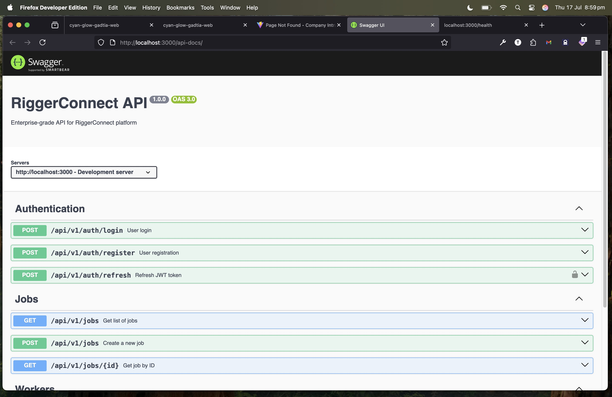

# RiggerConnect API

This repository contains the API technology and microservices for the RiggerConnect platform, focusing on enterprise-grade development and deployment.

## Features

- **Microservices Architecture**
- **RESTful API with Node.js and Express**
- **Security with JWT and CORS**
- **Documentation with Swagger/OpenAPI 3.0**

## API Documentation

The API is fully documented using Swagger/OpenAPI 3.0. Once the server is running, you can access the interactive documentation at `http://localhost:3000/api-docs`.



*Screenshot of the Swagger API documentation interface*

## Getting Started

### Prerequisites

- Node.js 18+
- npm 8+
- MongoDB 5+
- Redis 6+

### Installation

```bash
git clone https://github.com/tiation/tiation-rigger-connect-api.git
cd tiation-rigger-connect-api
npm install
```

### Running the Service

```bash
cp .env.example .env
npm run dev
```

## Contributing

We welcome contributions to the RiggerConnect API. Please read the [contributing guide](CONTRIBUTING.md) to learn how you can help.

## License

This project is licensed under the MIT License - see the LICENSE file for details.

## Contact

For support or inquiries, please contact [api-support@riggerconnect.com](mailto:api-support@riggerconnect.com).
